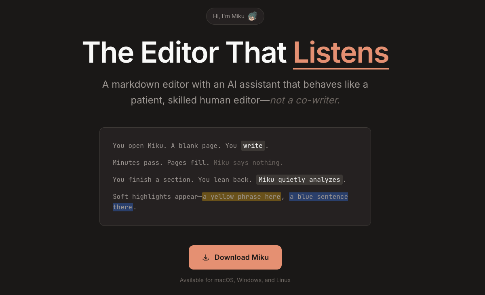

# Miku



**The Editor That Listens** — A markdown editor with an AI assistant that behaves like a patient, skilled human editor—*not a co-writer*.

## Goal

Miku aims to enable the use of local LLM tools by building specialized tools for niche use cases. Rather than trying to be everything to everyone, Miku focuses on being the best writing companion for markdown authors.

## What is Miku?

You open Miku. A blank page. You **write**.

Minutes pass. Pages fill. Miku says nothing.

You finish a section. You lean back. `Miku quietly analyzes`.

Soft highlights appear—*a yellow phrase here*, *a blue sentence there*.

Miku is a markdown editor that:
- Lets you write without interruption
- Quietly analyzes your text in the background
- Provides gentle, non-intrusive feedback through subtle highlights
- Acts as a patient editor, not an AI that tries to write for you

## Download

Available for macOS, Windows, and Linux.

## Getting Started

First, run the development server:

```bash
npm run dev
# or
yarn dev
# or
pnpm dev
# or
bun dev
```

Open [http://localhost:3000](http://localhost:3000) with your browser to see the result.

## Tech Stack

This is a [Next.js](https://nextjs.org) project using [`next/font`](https://nextjs.org/docs/app/building-your-application/optimizing/fonts) to automatically optimize and load [Geist](https://vercel.com/font).

## License

MIT License - see [LICENSE](LICENSE) for details.
